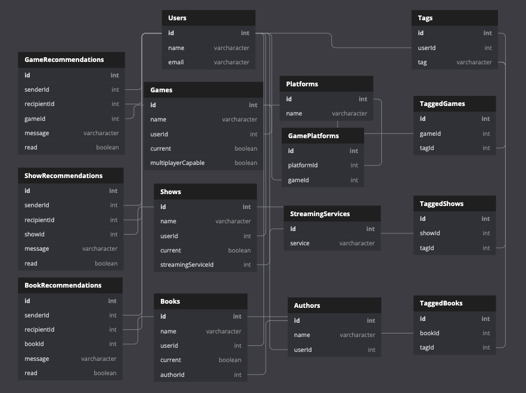

# Trove

> Track all of your media in one place.

---

### Table of Contents

- [Description](#description)
- [Features](#features)
- [Technologies](#technologies)
- [Installation](#installation)
- [Demo](#demo)
- [ERD](#erd)
- [License](#license)
- [Author Info](#author-info)

---

## Description

As someone who picks up new games, shows, and books almost weekly, only to forget about them before finishing them, I needed a way to organize my media. 

To solve this issue, I created a media tracking app that allows users to keep all of their current and queued media in one place. This way, they do not have to travel to multiple apps (Netflix, Steam, Goodreads, etc) to find their lists, and can filter all of their media by genre at once. 

My goals for this app were to achieve full CRUD, to create a complex tagging system and buildable filtering features, to add in error handling for any form entries, to learn how to use Bootstrap/Reactstrap, to manage my state in a clear and concise way, and to learn more about user experience.

## Features
- Users can create or delete books, games, and shows to and from their personal lists. When creating new items, users can add multiple tags to each item using a dynamic select dropdown, built with React Select.
- Users can edit all fields of each media item.
- Users can track whether they are currently using a media item by organizing it onto two different lists (current or queued).
- Users can filter each list or their entire library at once by multiple categories. When filtering by tag, users can choose multiple tags at once to futher narrow down the selection.
- Users can send media items to other registered users as recommendations.
- Users can add, delete, or edit their tags on the tag management page

#### Technologies

- HTML5
- CSS3
- Javascript
- React
- Git
- Github
- JSON Server
- Visual Studio Code
- Bootstrap/Reactstrap
- React Select

---


#### Installation
1. Clone this repository and change to the directory in the terminal.

```sh
git clone git@github.com:LeahDaniel/trove.git
cd trove
```
2. Access the data

<a href="https://github.com/LeahDaniel/trove-api" target="_blank" rel="noreferrer"></a>

3. Launch the application

```sh
npm install
npm start
```

---
### Demo
<a href="https://loom.com/share/c8322025a4e844f995e9470c5bafafbf"></a>

#### ERD

---

## License

MIT License

Copyright (c) [2022] [Leah J Daniel]

Permission is hereby granted, free of charge, to any person obtaining a copy
of this software and associated documentation files (the "Software"), to deal
in the Software without restriction, including without limitation the rights
to use, copy, modify, merge, publish, distribute, sublicense, and/or sell
copies of the Software, and to permit persons to whom the Software is
furnished to do so, subject to the following conditions:

The above copyright notice and this permission notice shall be included in all
copies or substantial portions of the Software.

THE SOFTWARE IS PROVIDED "AS IS", WITHOUT WARRANTY OF ANY KIND, EXPRESS OR
IMPLIED, INCLUDING BUT NOT LIMITED TO THE WARRANTIES OF MERCHANTABILITY,
FITNESS FOR A PARTICULAR PURPOSE AND NONINFRINGEMENT. IN NO EVENT SHALL THE
AUTHORS OR COPYRIGHT HOLDERS BE LIABLE FOR ANY CLAIM, DAMAGES OR OTHER
LIABILITY, WHETHER IN AN ACTION OF CONTRACT, TORT OR OTHERWISE, ARISING FROM,
OUT OF OR IN CONNECTION WITH THE SOFTWARE OR THE USE OR OTHER DEALINGS IN THE
SOFTWARE.

---

## Author Info

[Github](https://github.com/LeahDaniel)

[Linkedin](https://www.linkedin.com/in/leah-daniel/)

[Back To The Top](#trove)
